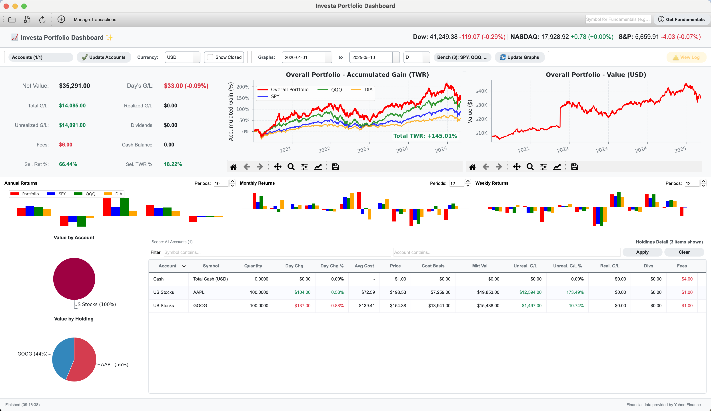
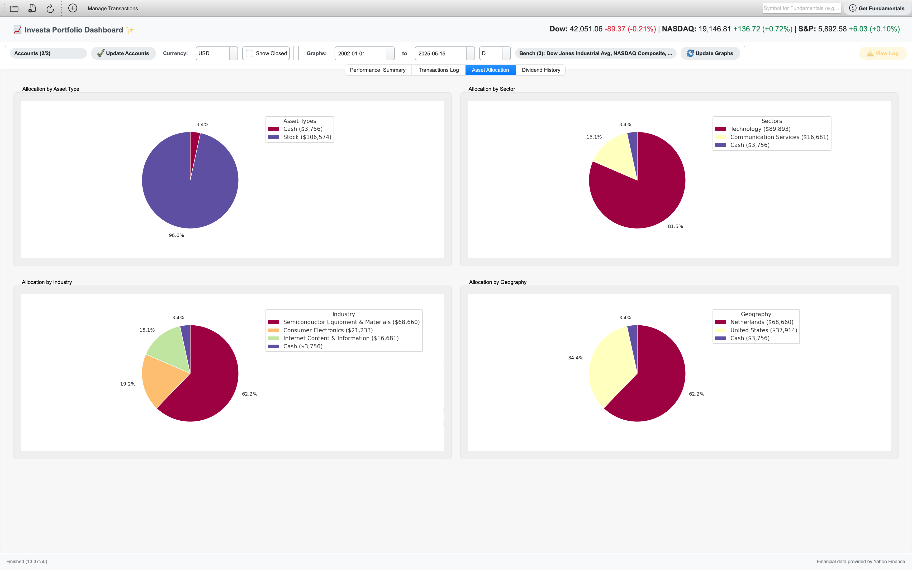

# Investa Portfolio Dashboard

[](https://opensource.org/licenses/MIT)

Investa is a comprehensive portfolio management solution offering both a feature-rich **Desktop Application** and a modern **Web Dashboard**. It helps you track, analyze, and visualize your investment portfolio using a local SQLite database for complete data privacy.

## Features

* **Secure Data:** Local SQLite database for full privacy.
* **Portfolio Summary:** Real-time net value, gains/losses (realized & unrealized), dividends, and TWR.
* **Comprehensive Holdings:** Sortable table with detailed metrics for stocks, ETFs, and cash.
* **Transactions:** Direct database editing, CSV import/export, and full history log.
* **Multi-Currency:** converting all assets to your preferred display currency (e.g. USD, EUR, JPY).
* **Performance Charts:** Time-Weighted Return (TWR) vs. Benchmarks (SPY, QQQ) and Portfolio Value over time.
* **Dividend Tracking:** Charts and tables for annual/quarterly/monthly dividend income.
* **Advanced Analysis:** Asset allocation, Correlation Matrix, Factor Analysis, and Scenario Analysis.
* **Rebalancing:** Calculator to help you rebalance portfolio to target allocations.
* **Web & Mobile:** Sleek Web Dashboard with mobile-optimized navigation and market indices.
* **Fundamental Data:** Built-in viewer for company profiles, financials, and balance sheets.

## Getting Started

For a step-by-step guide on setup, usage, and configuration, please see our detailed tutorial:

➡️ **[Investa User Tutorial](TUTORIAL.md)**

## Screenshots





## Technology Stack

* **GUI:** PySide6 (Qt for Python)
* **Web:** Next.js, React, Tailwind CSS, FastAPI
* **Data:** pandas, NumPy, sqlite3, yfinance
* **Analysis:** SciPy, Numba, statsmodels

## Installation

Requires Python 3.8+.

1.  **Clone the Repository**
    ```bash
    git clone https://github.com/StockAlchemist/Investa.git
    cd Investa
    ```

2.  **Create Virtual Environment**
    ```bash
    python3 -m venv venv
    source venv/bin/activate  # Windows: .\venv\Scripts\activate
    ```

3.  **Install Dependencies**
    ```bash
    pip install -r requirements.txt
    ```

4.  **Install Web App (Optional)**
    ```bash
    cd web_app && npm install && cd ..
    ```

## Quick Usage

**Run Everything (Desktop + Web):**
```bash
./start_investa.sh
```

**Run Desktop Only:**
```bash
python src/main_gui.py
```

*See the [Tutorial](TUTORIAL.md) for detailed usage instructions.*

## Configuration & Data

Investa stores your database (`investa_transactions.db`) and configuration files in your operating system's standard application data directory:

*   **macOS:** `~/Library/Application Support/StockAlchemist/Investa/`
*   **Windows:** `C:\Users\<User>\AppData\Local\StockAlchemist\Investa\`
*   **Linux:** `~/.local/share/StockAlchemist/Investa/`

For details on `gui_config.json`, `manual_overrides.json`, and input formats, consult the **[Tutorial](TUTORIAL.md#configuration-persistence-gui_configjson--manual_overridesjson)**.

## Input Data Format (CSV) 

Investa supports importing transaction history from CSV. 

*   **Key Fields:** `Date`, `Type`, `Symbol` (`$CASH` for cash), `Quantity`, `Price/Share`, `Account`.
*   **Format:** See **[Tutorial: Input Data Format](TUTORIAL.md#part-1-getting-set-up)** for the detailed specification.

## Troubleshooting

Common issues regarding market data loading or CSV imports are addressed in the **[Tutorial: Tips & Troubleshooting](TUTORIAL.md#part-12-tips--troubleshooting)**.

## Contributing

See **[CONTRIBUTING.md](CONTRIBUTING.md)** and **[CODE_OF_CONDUCT.md](CODE_OF_CONDUCT.md)**.

## License

MIT License. See [LICENSE](LICENSE).

## Author

* **Google Gemini**
