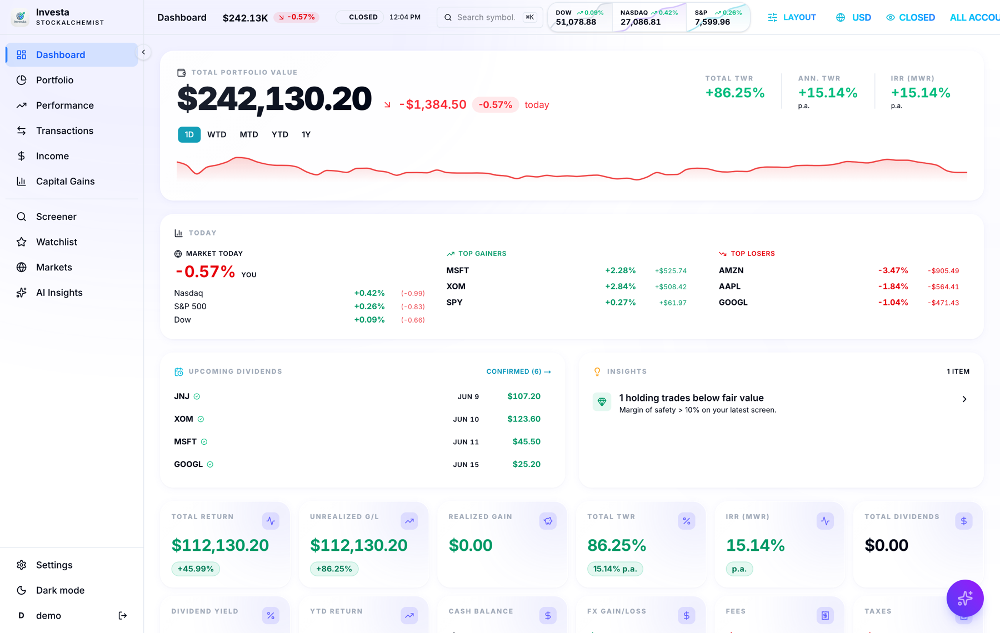
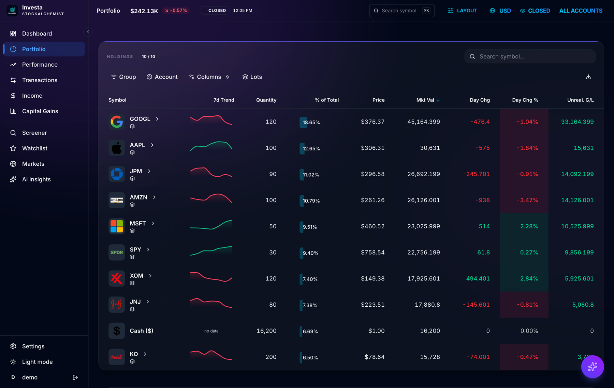
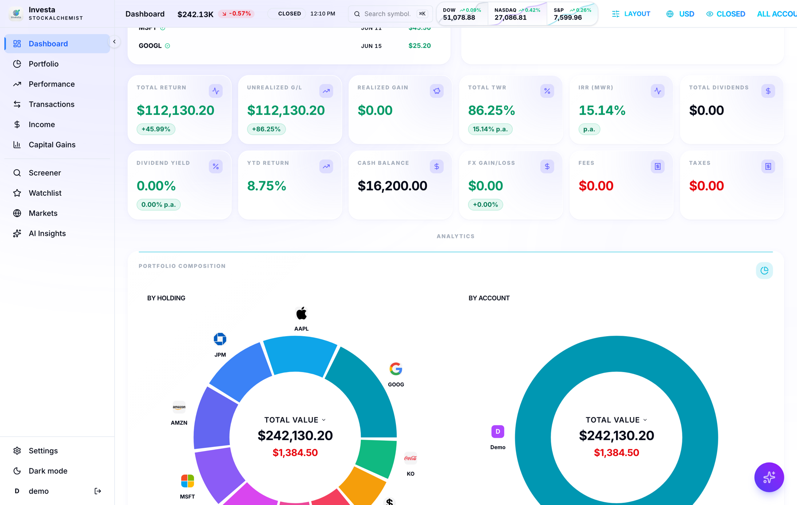
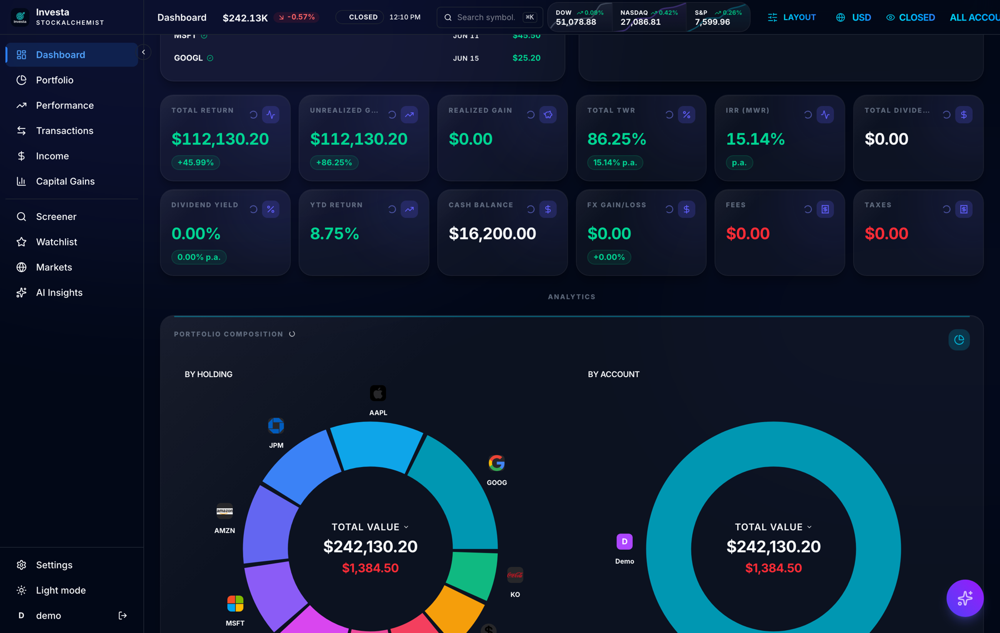
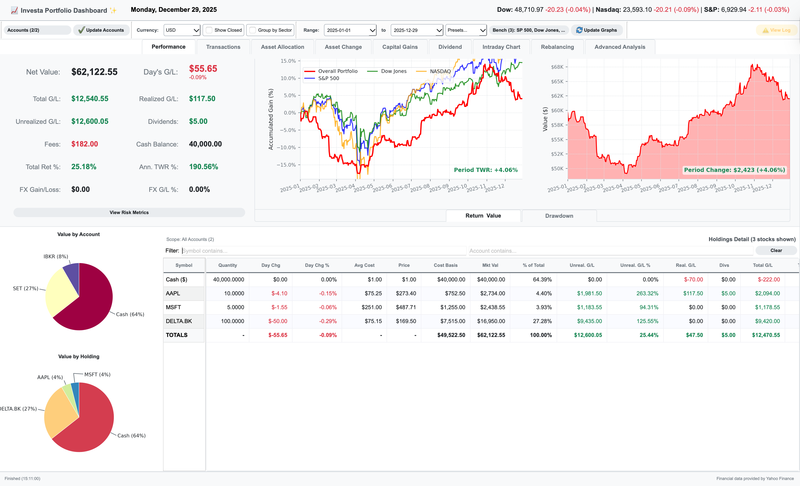
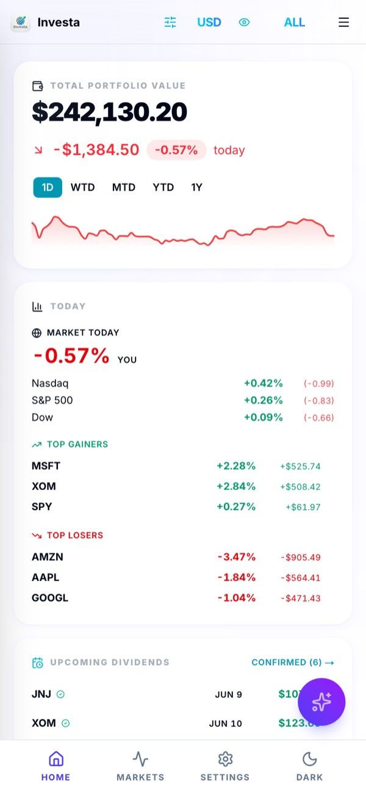

# Investa Portfolio Dashboard v1.1

[](https://opensource.org/licenses/MIT)

Investa is a comprehensive portfolio management solution offering both a feature-rich **Desktop Application** and a modern **Web Dashboard**. It helps you track, analyze, and visualize your investment portfolio using a local SQLite database for complete data privacy.

## Features

* **Secure Data:** Local SQLite database for full privacy.
* **Portfolio Summary:** Real-time net value, gains/losses (realized & unrealized), dividends, and TWR.
* **Comprehensive Holdings:** Sortable table with detailed metrics for stocks, ETFs, and cash.
* **Transactions:** Direct database editing, CSV import/export, and full history log.
* **Multi-Currency:** converting all assets to your preferred display currency (e.g. USD, EUR, JPY).
* **Performance Charts:** Time-Weighted Return (TWR) vs. Benchmarks (SPY, QQQ) and Portfolio Value over time, including **gapless intraday views** (1D, 5D) with **intelligent caching** for instant after-hours loading.
* **Interactive Price Charts:** Detailed stock price charts with **Moving Averages (SMA 50/200)**, configurable time ranges (1D to Max), and gain/loss shading, plus optional **overlays** for your buy/sell transactions (with realized gain/loss shown in sell tooltips), dividend payouts, earnings dates, and benchmark comparison lines.
* **Dividend Tracking:** Charts and tables for annual/quarterly/monthly dividend income, including **forward-looking Annual Yield %** metrics.
* **Advanced Analysis:** Asset allocation, Correlation Matrix, Factor Analysis, and Scenario Analysis.
* **Rebalancing:** Calculator to help you rebalance portfolio to target allocations.
* **Web & Mobile:** Sleek Web Dashboard with mobile-optimized navigation, market indices, and a **comprehensive Market Screener**.
* **Market Screener:** identify opportunities across your Watchlist, Holdings, or the **entire database ("All Stocks")** with quantitative intrinsic value filters.
* **AI Score:** Intelligent **scorecard-based rankings** in the Watchlist and Screener to help prioritize high-probability investments.
* **Custom Groups (Tags):** Organize holdings with custom tags (e.g., "Core", "Speculative") for personalized grouping.
* **Contribution Analysis:** See exactly how much each holding contributes to your total portfolio return.
* **Customizable Layouts:** A **Layout Configurator** on every tab lets you toggle and arrange widgets (including "Sector Contribution" and "Top Contributors") to build your own views; your layout persists across sessions.
* **Fundamental Data:** Built-in viewer for company profiles, financials, and balance sheets.
* **Intrinsic Value Analysis:** Automated **DCF (Income & Revenue-based)** and **Graham's Revised Formula** calculations **(with NAV support for ETFs)** with **Monte Carlo simulations**, **currency normalization**, and **stability logic (Growth Capping & Linear Fading)**.
* **AI Portfolio Review:** Intelligent AI-powered analysis of your portfolio holdings, providing personalized insights, risk assessments, and diversification suggestions.
* **Data Robustness:** Built-in **Ticker Normalization** (e.g., mapping `BRK.B` to `BRK-B`) and sanitization to prevent batch-fetch failures.
* **User Authentication:** Secure login and registration system with multi-user support.
* **HTTPS Support:** Built-in Tailscale Serve configuration for secure, encrypted access on local networks and mobile devices.
* **Valuation Overrides:** Fully customizable valuation parameters (growth rates, discount rates, etc.) for each stock via the Settings menu or individual detail views.
* **Batch Recalculation:** Dedicated scripts for bulk updating valuations for large universes like the S&P 500.
* **IBKR Integration:** Automated syncing of transactions from Interactive Brokers via Web Flex Service with a staging area for review and approval.
* **Brokerage Statement Import:** Import transactions directly from **PDF / image statements** — deterministic parsers for **Interactive Brokers** and **Webull**, plus an AI fallback for other brokers — with an import-review step that flags already-imported rows to prevent duplicates.
* **Annualized Performance:** Key metrics like **IRR (MWR)** are clearly labeled as **"Ann."** when displayed as annualized returns for better clarity.
* **Interactive Donut Charts:** The Portfolio tab features large, fully interactive allocation donut charts (by Asset Type, Sector, Geography, Industry) with hover-to-highlight slices and an inline legend showing value and percentage.
* **Allocation Drift Alerts:** Set a target allocation per group (e.g., 60% Sector/Technology) via the Portfolio tab. Live drift cards show how far each slice has moved from its target, colour-coded by severity, and persist across sessions.
* **Tax-Lot View:** The Capital Gains tab now includes a **short-term vs. long-term** lot summary with a ranked table of **tax-loss harvesting candidates**, wash-sale warnings, and a "ripening" section for short-term lots graduating to long-term within 30 days.
* **Custom Benchmark Tickers:** Add any valid ticker (e.g., `VT`, `TQQQ`, individual stocks) as a custom benchmark in the Performance graph alongside the built-in presets.
* **Enhanced Fundamentals (FMP Fallback):** For stocks that yfinance misclassifies — including foreign companies listed on US exchanges as ADRs — a Financial Modeling Prep (FMP) enrichment layer correctly identifies the domicile country, sector, and industry.
* **Collapsible Sidebar & Search:** The web app navigation is a collapsible sidebar. Press **⌘K** (or Ctrl+K) at any time to open a symbol search palette for quick stock lookups without leaving the current view.
* **News Feed:** A dedicated **Markets** tab aggregates general market news alongside per-stock news, accessible directly from the sidebar.

## Getting Started

For a step-by-step guide on setup, usage, and configuration, please see our detailed tutorial:

➡️ **[Investa User Tutorial](TUTORIAL.md)**

## Screenshots

<div align="center">
  <table>
    <tr>
      <td align="center">
        <b>Dashboard Light Theme</b><br>
        
      </td>
      <td align="center">
        <b>Holdings Dark Theme</b><br>
        
      </td>
    </tr>
    <tr>
      <td align="center">
        <b>Allocation Light Theme</b><br>
        
      </td>
      <td align="center">
        <b>Allocation Dark Theme</b><br>
        
      </td>
    </tr>
    <tr>
      <td align="center">
        <b>Desktop App</b><br>
        
      </td>
      <td align="center">
        <b>Mobile View</b><br>
        
      </td>
    </tr>
  </table>
</div>

## Technology Stack

* **GUI:** PySide6 (Qt for Python)
* **Web:** Next.js, React, Tailwind CSS, FastAPI
* **Data:** pandas, NumPy, sqlite3, yfinance
* **Analysis:** SciPy, Numba, statsmodels

## Installation

Requires Python 3.8+.

1. **Clone the Repository**

    ```bash
    git clone https://github.com/StockAlchemist/Investa.git
    cd Investa
    ```

2. **Create Virtual Environment**

    ```bash
    python3 -m venv venv
    source venv/bin/activate  # Windows: .\venv\Scripts\activate
    ```

3. **Install Dependencies**

    ```bash
    pip install -r requirements.txt
    ```

4. **Install Web App (Optional)**

    ```bash
    cd web_app && npm install && cd ..
    ```

## Quick Usage

**Run Everything (Desktop + Web):**

```bash
./start_investa.sh
```

**Run Desktop App (Electron):**

```bash
./start_desktop.sh
```

**Run Legacy Python GUI:**

```bash
python src/main_gui.py
```

*See the [Tutorial](TUTORIAL.md) for detailed usage instructions.*

## HTTPS Configuration (Highly Recommended)

Investa includes a built-in configuration tool to secure your app with HTTPS using Tailscale Serve. this is **required** for proper autofill functionality on mobile devices and secure remote access.

1. **Ensure Tailscale is installed and running.**
2. **Run the configuration script:**

    ```bash
    ./enable_https.sh
    ```

3. **Use the provided HTTPS URL** (e.g., `https://your-node.ts.net`) to access the dashboard.

## Configuration & Data

Investa stores your database (`investa_transactions.db`) and configuration files in your operating system's standard application data directory:

* **macOS:** `~/Library/Application Support/StockAlchemist/Investa/`
* **Windows:** `C:\Users\<User>\AppData\Local\StockAlchemist\Investa\`
* **Linux:** `~/.local/share/StockAlchemist/Investa/`

For details on `gui_config.json`, `manual_overrides.json`, and input formats, consult the **[Tutorial](TUTORIAL.md#configuration-persistence-gui_configjson--manual_overridesjson)**.

## Input Data Format (CSV)

Investa supports importing transaction history from CSV.

* **Key Fields:** `Date`, `Type`, `Symbol` (`$CASH` for cash), `Quantity`, `Price/Share`, `Account`.
* **Format:** See **[Tutorial: Input Data Format](TUTORIAL.md#part-1-getting-set-up)** for the detailed specification.

## Troubleshooting

Common issues regarding market data loading or CSV imports are addressed in the **[Tutorial: Tips & Troubleshooting](TUTORIAL.md#part-12-tips--troubleshooting)**.

## Contributing

See **[CONTRIBUTING.md](CONTRIBUTING.md)** and **[CODE_OF_CONDUCT.md](CODE_OF_CONDUCT.md)**.

## License

MIT License. See [LICENSE](LICENSE).

## Author

* **Google Gemini and Claude**
