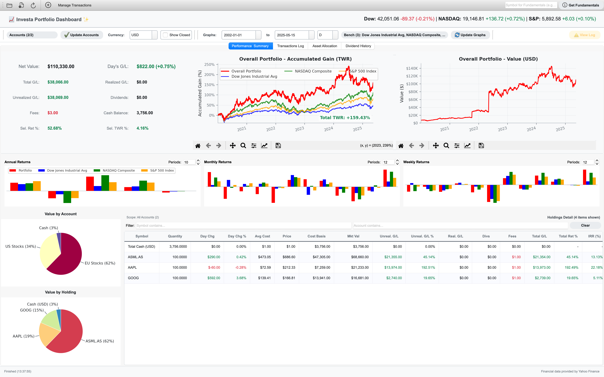
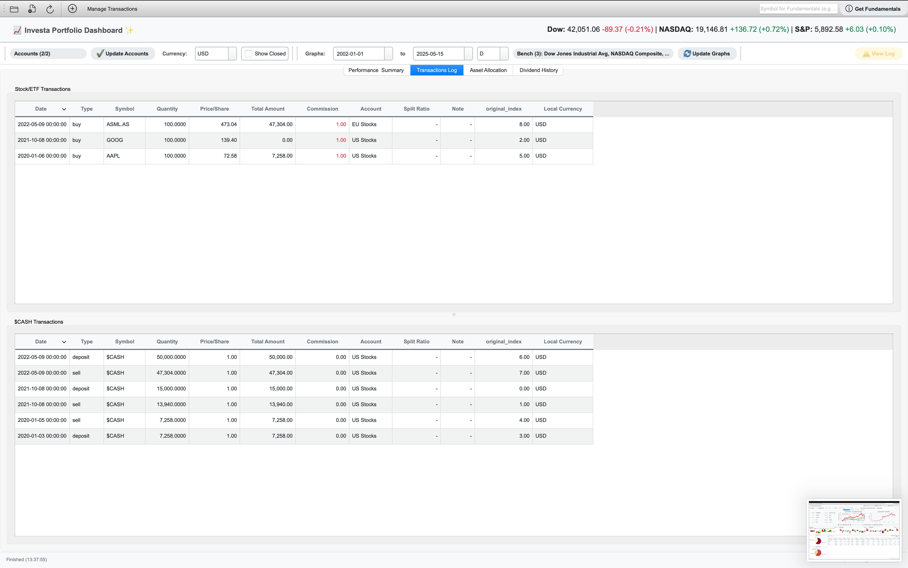

# Investa Portfolio Dashboard

[](https://opensource.org/licenses/MIT)

Investa is a desktop application designed to help you track, analyze, and visualize your investment portfolio. It uses a local SQLite database to store transaction data, fetches current market prices, and provides a comprehensive overview of your holdings, performance, and historical trends.

## Features

* **Database Integration:** Securely stores all transaction data in a local SQLite database (`investa_transactions.db`), ensuring data persistence and integrity.
* **Portfolio Summary:** Get a clear overview of your investments, including current market values, cost basis, unrealized and realized gains/losses, total dividends received, and overall portfolio return.
* **Detailed Holdings Table:** Dive into individual stock, ETF, and cash positions. Features sortable columns (e.g., by symbol, quantity, market value, gain/loss) and allows customization of visible columns to tailor the view to your needs.
* **Transaction Management (Comprehensive):**
  * **Direct Database Operations:** Add, edit, and delete transactions directly within the application via a dedicated management dialog, with changes immediately reflected in the SQLite database.
  * **Transaction Log Tab:** View chronological logs of Stock/ETF transactions and $CASH transactions separately, with filtering capabilities based on the main account selection.
  * **CSV Import/Export:** Easily import transactions from CSV files into the database and export your database transactions to a CSV file for backup or use in other tools.
* **Account Filtering & Management:** Filter your portfolio view by specific investment accounts (e.g., "Brokerage A," "IRA") or view an aggregated summary of all accounts.
* **Currency Management:**
  * Display portfolio values in your preferred global currency (e.g., USD, EUR, JPY).
  * Assign specific local currencies to different investment accounts for accurate tracking of multi-currency portfolios.
* **Historical Performance Charts (Enhanced Controls):**
  * **Time-Weighted Return (TWR):** Plot your portfolio's TWR against popular market benchmarks (e.g., SPY, QQQ) to gauge relative performance.
  * **Absolute Portfolio Value:** Visualize the growth of your portfolio's total market value over time.
  * **Customizable Views:** Adjust date ranges, select comparison benchmarks, and choose different time intervals (Daily, Weekly, Monthly) for granular analysis.
* **Periodic Returns Bar Charts:** Analyze performance over specific periods. View portfolio and benchmark returns for annual, monthly, and weekly durations with adjustable lookback periods.
* **Dividend History Tab:**
  * **Visualizations:** Track dividend income over time with charts for Annual, Quarterly, and Monthly payouts.
  * **Detailed Tables:** View a summary table of aggregated dividends (matching the chart) and a comprehensive table of all individual dividend transactions (filtered by selected accounts), including dates, symbols, and amounts.
* **Portfolio Allocation Pie Charts:**
  * **Composition Analysis:** Understand your portfolio's diversification by account and by individual holding.
  * **Categorical Breakdown:** View asset allocation by Asset Type (e.g., Stock, ETF, Cash), Sector (e.g., Technology, Healthcare), Geography (e.g., US, International), and Industry. (Note: Sector, Geography, and Industry breakdowns require fundamental data for symbols, fetched via Yahoo Finance, or manual overrides).
* **Symbol Settings (Overrides, Mapping, Exclusions):**
  * **Manual Overrides:** For any symbol, manually set or adjust `price`, `asset_type`, `sector`, `geography`, and `industry`. This is crucial when API data is missing, incorrect, or when you need to define custom classifications.
  * **Symbol Mapping:** Define aliases or map alternative ticker symbols to a primary symbol (e.g., map "BRK.B" to "BRK-B") for consistent data fetching and display.
  * **Symbol Exclusions:** Specify symbols to be excluded from market data fetching or certain calculations.
  * All managed via `Settings > Symbol Settings...` and stored in `manual_overrides.json`.
* **Advanced Analysis Tab:**
  * **Correlation Matrix:** Visualize the correlation of daily returns between portfolio assets.
  * **Factor Analysis:** Perform Fama-French or Carhart factor analysis to identify the drivers of portfolio returns (alpha, beta).
  * **Scenario Analysis:** Simulate the impact of hypothetical market shocks on your portfolio.
* **Rebalancing Tab:**
  * Load your current holdings and define target allocations for each asset.
  * Automatically calculate the required buy/sell trades to rebalance your portfolio to your desired targets.
* **Fundamental Data Viewer (Multi-Tab):**
  * Access key fundamental data for stock symbols directly within the app.
  * **Overview Tab:** Company profile, key statistics (market cap, P/E, dividend yield & rate), price stats (52-week high/low, volume), and business summary.
  * **Financials, Balance Sheet, Cash Flow Tabs:** View detailed financial statements (annual and quarterly).
* **Market Data Fetching & Caching:**
  * Retrieves near real-time stock quotes, index prices, and foreign exchange (FX) rates using Yahoo Finance.
  * Caches fetched market data locally to accelerate subsequent application loads and minimize redundant API calls, improving performance and reducing reliance on constant internet connectivity.
* **Configuration Persistence:** Saves UI settings (e.g., database file path, selected display currency, active accounts, graph configurations, table column visibility, user-defined currency lists) in `gui_config.json` for a consistent user experience across sessions.
* **Table Filtering:** Dynamically filter the main holdings table by typing text, making it easy to find specific assets quickly.
* **CSV Format Help & Standardization:**
  * In-app guide explains the recommended CSV format for importing transactions.
  * Utility to standardize CSV headers to the application's preferred internal format before import.
* **Numba Optimization:** Leverages Numba to accelerate computationally intensive historical portfolio value calculations, providing faster chart loading and analysis.

## Getting Started Tutorial

For a step-by-step guide on how to set up and use Investa, please see our detailed tutorial (work in progress):

➡️ **[Investa User Tutorial](TUTORIAL.md)**

## Screenshots





## Technology Stack

* **GUI:** PySide6 (Qt for Python)
* **Data Handling & Analysis:** pandas, NumPy
* **Database:** sqlite3
* **Financial Calculations:** SciPy, Numba
* **Market Data:** yfinance
* **Charting:** Matplotlib (embedded in PySide6), mplcursors (for interactive tooltips)
* **Concurrency:** QThreadPool, QRunnable, multiprocessing

## Installation

This project requires Python 3.8 or higher.

1. **Clone the Repository**

    ```bash
    git clone https://github.com/StockAlchemist/Investa.git
    cd Investa
    ```

2. **Create and Activate a Virtual Environment** (Recommended)

    ```bash
    # For macOS/Linux
    python3 -m venv venv
    source venv/bin/activate

    # For Windows
    # python -m venv venv
    # .\venv\Scripts\activate
    ```

3. **Install Dependencies**
    All required packages are listed in `requirements.txt`. Install them with:

    ```bash
    pip install -r requirements.txt
    ```

## Configuration

User-specific configuration files (`gui_config.json`, `manual_overrides.json`), the SQLite database (`investa_transactions.db`), cache files, and CSV backups are stored in a standard application data directory, organized under "StockAlchemist" and then "Investa". The exact base path depends on your operating system:

* **macOS:** `~/Library/Application Support/StockAlchemist/Investa/` (or similar, based on `QStandardPaths.AppDataLocation`)
* **Windows:** `C:\Users\<YourUserName>\AppData\Local\StockAlchemist\Investa\` (or potentially in `AppData\Roaming`)
* **Linux:** `~/.local/share/StockAlchemist/Investa/` (or `~/.config/StockAlchemist/Investa/`)

Key files in this directory:

* **`investa_transactions.db`**: The SQLite database storing all your transaction data. This is the primary data source for the application.
* **`gui_config.json`**: Stores your UI preferences and settings. This includes:
  * Path to the currently loaded SQLite database file (`investa_transactions.db` or user-specified).
  * Selected global display currency.
  * List of active/selected investment accounts for filtering.
  * Current graph settings (date ranges, intervals, selected benchmarks).
  * Visibility status for columns in the main holdings table.
  * User-defined list of currencies for quick selection in dropdowns.
* **`manual_overrides.json`**: Stores symbol-specific configurations and data overrides. This JSON file contains:
  * **`manual_price_overrides`**: Manually set values for `price`, `asset_type`, `sector`, `geography`, and `industry` for specific symbols. Example: `{"AAPL": {"price": 175.00, "asset_type": "Stock", "sector": "Technology", "geography": "United States", "industry": "Consumer Electronics"}}`
  * **`user_symbol_map`**: User-defined mappings from alternative ticker symbols to a primary symbol. Example: `{"BRK.B": "BRK-B", "MSFT.NE": "MSFT"}`
  * **`excluded_symbols`**: A list of symbols to be excluded from market data fetching or certain calculations. Example: `["OLD_STOCK", "DELISTED_ETF"]`
  * These settings are managed via **Settings > Symbol Settings...** in the application.
* **`csv_backups/` (subfolder)**: Stores timestamped backups of your transactions CSV file if you've used the CSV import feature and opted for backups, or when exporting data.
* Cache files (e.g., for market data from `yfinance`) are also stored here to speed up loading times.

* **Account Currencies:**
  * Managed via `Settings > Account Currencies...` in the app. This allows you to specify the local currency for each of your investment accounts, stored within `gui_config.json`.
* **Advanced Configuration (`config.py`):**
  * Contains application-wide constants such as logging levels, cache durations, default benchmark symbols, and internal API settings. Modify this file directly only for advanced tweaks.
* **API Keys:**
  * The application primarily uses `yfinance` which generally does not require an API key for public data.
  * An environment variable `FMP_API_KEY` is checked (see `config.py`) but its usage is for optional, supplementary data and not core functionality.

## Input Data Format (Transactions CSV)

While Investa's primary data storage is the `investa_transactions.db` SQLite database, it supports importing transaction data from CSV files. The following format details are crucial for successful CSV imports.
A utility is provided within the application (`File > Import Transactions from CSV...` then `Standardize Headers`) to help map your CSV columns to the application's expected format.
The application can also attempt to automatically migrate data from a CSV file specified in the configuration if the database is empty on first startup.
**Key Considerations for CSV Import:**

* **`$CASH` Symbol:** This is a special reserved symbol used to manage cash balances within accounts.
  * **Deposits:** Record a "Deposit" transaction with `$CASH` as the symbol, positive quantity, and price of 1. The "Total Amount" should be the deposit amount.
  * **Withdrawals:** Record a "Withdrawal" transaction with `$CASH` as the symbol, negative quantity (or positive quantity and ensure "Total Amount" is negative), and price of 1. The "Total Amount" should be the withdrawal amount.
  * **Internal Cash Movements & TWR:** For accurate Time-Weighted Return (TWR) calculations, it's vital to log all cash inflows and outflows from an account. This includes dividends received in cash, interest, fees paid from cash, and transfers between accounts. Use `$CASH` with appropriate transaction types (Deposit, Withdrawal, Fees) to reflect these movements. For example, if you transfer $500 from Brokerage A to Brokerage B:
    * Brokerage A: `Type`: Withdrawal, `Symbol`: $CASH, `Quantity`: 500 (or Total Amount: -500)
    * Brokerage B: `Type`: Deposit, `Symbol`: $CASH, `Quantity`: 500 (or Total Amount: 500)
  * Dividends paid directly to a cash balance (not reinvested) should be recorded as a "Dividend" type transaction for the respective stock, which the system will then treat as a cash inflow to the account's `$CASH` balance. If importing general cash dividends not tied to a specific stock, use a "Deposit" transaction with `$CASH` and note it as "Dividend Income".
  * For more detailed examples of `$CASH` usage, please refer to the **Investa User Tutorial**.

**Preferred (Cleaned) CSV Headers for Import (Target format after standardization):**

1. `Date` (e.g., *Jan 01, 2023* or other common date formats)
2. `Type` (e.g., *Buy, Sell, Dividend, Split, Deposit, Withdrawal, Fees*)
3. `Symbol` (e.g., *AAPL, GOOG*. Use **`$CASH`** for cash-related transactions.)
4. `Quantity` (Number of units)
5. `Price/Share`
6. `Total Amount` (Optional for Buy/Sell if Quantity and Price/Share are provided)
7. `Commission` (Fees)
8. `Account` (Name of your brokerage account, e.g., *Brokerage A, IRA*)
9. `Split Ratio` (Required only for 'Split' type, e.g., *2* for a 2-for-1 split)
10. `Note` (Optional)

**Compatible (Verbose) CSV Headers (will be mapped internally during import/standardization):**

* `Date (MMM DD, YYYY)` maps to `Date`
* `Transaction Type` maps to `Type`
* `Stock / ETF Symbol` maps to `Symbol`
* `Quantity of Units` maps to `Quantity`
* `Amount per unit` maps to `Price/Share`
* `Fees` maps to `Commission`
* `Investment Account` maps to `Account`
* `Split Ratio (new shares per old share)` maps to `Split Ratio`
* `Total Amount` (typically the same)
* `Note` (typically the same)

For detailed examples and specific requirements for each transaction type, please refer to the **Help > CSV Format Help...** menu within the application.

## Usage

1. **Launch the Application**
    After installing dependencies, run the main script from the project's root directory:

    ```bash
    python src/main_gui.py
    ```

2. **Initial Setup (First Launch)**
    * You will be prompted to create a new SQLite database (`.db`) or open an existing one. This file will store all your transaction data.
    * The application will remember the location of your database for future sessions.

3. **Populate Your Data**
    * **Add Manually:** Use the `Transactions` menu to add, edit, or delete individual records (Buy, Sell, Dividend, etc.).
    * **Import from CSV:** Use `File > Import Transactions from CSV...` to bulk-import your history. Refer to the "Input Data Format" section or the in-app help for formatting details.

4. **Analyze Your Portfolio**
    * Click **Refresh All (F5)** to fetch the latest market data and recalculate all portfolio metrics.
    * Use the dashboard controls to filter by account, change display currency, and adjust chart settings.
    * Interact with tables and charts to explore your data in detail.

For a more comprehensive guide, please see our detailed tutorial: ➡️ **Investa User Tutorial**

## Building a Standalone Application (Optional)

You can package Investa as a standalone desktop application using PyInstaller.

1. **Install PyInstaller**

    ```bash
    pip install pyinstaller
    ```

2. **Generate a `.spec` File (Recommended First Step)**
    For a complex application, it's best to use a `.spec` file to manage build configurations. Generate a base file with:

    ```bash
    pyi-makespec --windowed --name Investa src/main_gui.py
    ```

    This creates `Investa.spec` in the `src/` directory. You should then edit this file to include necessary data files, hidden imports, and other options. A well-configured `.spec` file is more reliable than a long command-line string.

    *Example modifications for `src/Investa.spec`*:

    ```python
    # In src/Investa.spec
    a = Analysis(['src/main_gui.py'],
                 ...
                 datas=[('src/gui/style.qss', 'gui'), ('src/gui/style_dark.qss', 'gui'), ('src/gui/style_minimal.qss', 'gui'), ('src/Investa.icns', '.')], # Add data files
                 hiddenimports=['pandas', 'numpy', 'scipy', 'PySide6.QtSvg'], # Add hidden imports
                 ...
                 )
    ...
    app = BUNDLE(exe,
             name='Investa.app',
             icon='src/Investa.icns', # Specify icon for macOS
             bundle_identifier=None)
    ```

3. **Build the Application**
    Once your `.spec` file is configured, run the build from the project root:

    ```bash
    pyinstaller src/Investa.spec
    ```

    The final application bundle will be located in the `dist/` directory.

## Contributing

We welcome contributions to Investa! If you're interested in helping out, please take a look at our **[Contributing Guidelines](CONTRIBUTING.md)** for more information on how to get started, coding standards, and how to submit your changes.

We appreciate your help in making Investa better!

## Code of Conduct

Please note that this project is released with a Contributor Code of Conduct. By participating in this project you agree to abide by its terms. See [CODE_OF_CONDUCT.md](CODE_OF_CONDUCT.md) for details.

## License

This project is licensed under the MIT License - see the [LICENSE](LICENSE) file for details (or include the MIT license text directly if no separate file).

SPDX-License-Identifier: MIT

## Author

* **Google Gemini 2.5 and Kit Matan** - <kittiwit@gmail.com>

## Troubleshooting / FAQ

* **Market Data Not Loading (e.g., prices show as 0 or NaN):**
  * **Check Internet Connection:** Ensure you have an active internet connection. `yfinance` needs to fetch data online.
  * **Symbol Validity:** Verify that the stock/ETF symbols in your transactions are correct and recognized by Yahoo Finance. Some symbols might have changed or been delisted. Use the `Settings > Symbol Settings...` to map old symbols to new ones if needed (e.g., `BRK.B` to `BRK-B`).
  * **API Limits/Issues:** Yahoo Finance might occasionally have temporary issues or impose rate limits. Try refreshing data after some time.
  * **Firewall/VPN:** Your firewall or VPN might be blocking requests to Yahoo Finance. Try temporarily disabling them to check.
  * **Excluded Symbols:** Ensure the symbol is not in the exclusion list under `Settings > Symbol Settings...`.
  * **Cache:** Try clearing the cache via `File > Clear Cache and Restart` (if available) or by manually deleting cache files from the application data directory.

* **CSV Import Errors:**
  * **Incorrect Format:** Ensure your CSV file strictly follows the format described in the "Input Data Format (Transactions CSV)" section or use the "Standardize Headers" utility during import. Pay close attention to date formats, transaction types, and required fields like `Symbol`, `Quantity`, `Price/Share`.
  * **Special Characters/Encoding:** Save your CSV as UTF-8 encoded. Unusual characters in notes or symbols might cause issues.
  * **Large Files:** For very large CSV files, import in smaller chunks if possible.
  * **Header Row:** Ensure your CSV has a header row that matches either the "Preferred (Cleaned)" or "Compatible (Verbose)" headers.

* **Data Inaccuracies (e.g., incorrect cost basis, gains):**
  * **Transaction Data Entry:** Double-check all your transactions in the "Transaction Log" tab for accuracy. Errors in dates, quantities, prices, types (Buy/Sell/Dividend/Split), or fees will lead to miscalculations.
  * **`$CASH` Transactions:** Ensure all cash movements (deposits, withdrawals, fees paid from cash, inter-account transfers) are correctly logged using the `$CASH` symbol as described. Missing cash flow data is a common source of TWR discrepancies.
  * **Splits and Dividends:** Verify that stock splits are entered correctly with the right ratio and that all dividends (especially reinvested ones) are recorded.
  * **Currency Settings:** Ensure your global display currency and account-specific currencies are set correctly.
  * **Manual Overrides:** Check if any manual overrides for prices in `Settings > Symbol Settings...` are affecting calculations unexpectedly.

* **Application Slowdown:**
  * **Large Database:** A very large number of transactions over many years can slow down calculations.
  * **Market Data Fetching:** Initial data fetch for many symbols can be slow. Subsequent loads should be faster due to caching.
  * **Numba JIT Compilation:** The first time calculations are run (e.g., historical TWR), Numba compiles functions, which might take a moment. Subsequent runs are faster.

* **"File not found" error for database on startup:**
  * This usually means the database file (`investa_transactions.db` or a custom-named one) that was last opened cannot be found at its previous location.
  * The application will prompt you to either locate the existing `.db` file or create a new one.
  * Ensure the path stored in `gui_config.json` under `database_path` is correct or select the correct file when prompted.

* **Error related to `matplotlib` or `PySide6` backend:**
  * Ensure these libraries are correctly installed in your Python environment. Reinstalling them (`pip install --force-reinstall PySide6 matplotlib`) might help.
  * Conflicts with other GUI libraries or incorrect environment setup can sometimes cause these. Using a clean virtual environment is recommended.

---

*Disclaimer: This software is for informational and educational purposes only. It is not financial advice. Always do your own research and consult with a qualified financial advisor before making investment decisions. Market data is typically provided by Yahoo Finance and may be delayed or contain inaccuracies.*
